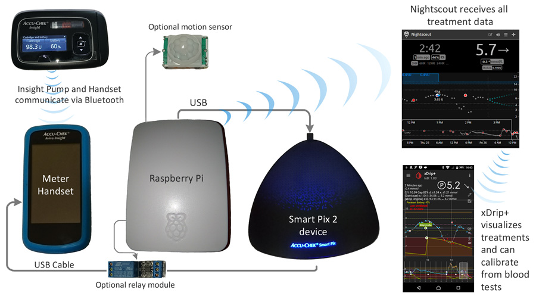

# Smart Pix Insight Nightscout Uploader

## What this is for?

The script is designed to pull data from the Insight pump and handset when connected and to upload this data to Nightscout autonomously.

This includes, blood test results, insulin doses and pump events. (complete basal data soon)

Using xDrip+ connected to Nightscout via the standard REST-API feature, the treatment data is then downloaded, so treatment simulations and automated opportunistic cgm calibration can occur.

Because the Insight handset can be set to `always connect to PC` and also charges while connected to the Smart Pix device, the data can be automatically synchronized simply by plugging the handset in to charge when it is not in use and data download occurs with no user operation required.

#### Example output:

    2017-05-24 21:49:33,355 : Requesting new data - this can take several minutes
    2017-05-24 21:49:33,951 : Pix status: 5 NOSCAN
    2017-05-24 21:49:35,978 : Status changed to: unknown  please wait
    2017-05-24 21:50:49,162 : Pix status: 8 SCAN BGREQUEST IPREQUEST
    2017-05-24 21:50:49,164 : Status changed to: running
    2017-05-24 21:51:10,736 : Pix status: 12 NOSCAN BGREPORT IPREPORT
    2017-05-24 21:51:10,738 : Status changed to: done
    2017-05-24 21:51:11,240 : Scan complete after: 97 seconds
    2017-05-24 21:51:13,385 : Uploaded 259 records successfully in 0 seconds

## What do I need?

This python script is designed to run on a Linux machine, typically a Raspberry Pi.

Connected to the Linux machine via USB is the Smart Pix 2 interface device. The Insight pump handset is plugged in to this via its micro-usb charging connector.

If you don't already have a Smart Pix 2 device, these are available from the pump manufacturer.

## How do I set it up?

Plug the Smart Pix 2 device in to a USB port on your Linux machine

Plug the micro-usb cable from the Smart Pix in to the Insight Handset

Select `Connect to PC` on the Handset screen. Ideally also select the option to always connect to PC without asking.

You'll need a Nightscout installation and to know your URL and API password

Download the `smart-pix-reader.py` script to your Linux machine

    usage: smart-pix-reader.py [-h] --base_url BASE_URL --api_secret API_SECRET
                           [--meter_serial METER_SERIAL] [--constant]
                           [--skip_reload] [--debug] [--timezone TIMEZONE]

    Smart Pix reader - designed for Insight pump/handset. Can upload data to
    Nightscout and trigger xDrip+ calibrations. Any use is entirely at your own
    risk, code provided on an 'AS IS' basis only. Not endorsed by any equipment
    manfacturer.

    optional arguments:
      -h, --help            show this help message and exit
      --base_url BASE_URL   Base URL of Nightscout site
      --api_secret API_SECRET
                            API-SECRET for uploading
      --meter_serial METER_SERIAL
                            Restrict to meter serial number
      --constant            Run constantly looking for new data
      --skip_reload         Don't reload new data from the device
      --debug
      --relay_pin RELAY_PIN
                            Specify which GPIO pin an optional relay is connected
      --motion_pin MOTION_PIN
                            Specify which GPIO pin an optional motion sensor is
                            connected to

      --timezone TIMEZONE   Timezone to use if not Etc/UTC eg: Europe/London

### Using the right Timezone!
In order to make sure the entries match the correct times in Nightscout you must be sure that you set the time on your Insight handset correctly.

* If you live in a region which uses daylight saving time and you manually change your Insight Handset clock to accurately reflect your local time then you should tell the script to use your local timezone.
* If you live in a region which doesn't use daylight saving time then you should also specify your local timezone.
* If, however, you don't adjust the clock on your handset when daylight saving time starts/finishes each year but you DO live in a region which uses daylight saving time then you need to specify the timezone as the offset from GMT/UTC that your pump handset has.

If you get this wrong then treatment entries in Nightscout are likely to appear at the wrong times and opportunistic calibration will be completely broken.

You also should make sure that your pump handset has the *exact* correct time as close as you can set it. The more accurate the clock is set on it, the more accurate any automated calibrations will be. Remember to promptly update your clock after daylight saving time transisitions.

Timezones might look like `Europe/London` or `America/New_York` for a region timezone. (see https://en.wikipedia.org/wiki/List_of_tz_database_time_zones for a list)

For an absolute offset timezone where you don't change the clock for daylight saving time it would look more like `Etc/GMT+1` for 1 hour ahead of GMT/UTC.

## Example Usage

    python smart-pix-reader.py --base_url http://example.azurewebsites.net \
                               --api_secret mypassw0rd --timezone Europe/London

If there is any chance of a different handset being connected then you can lock it to work with only handset using the 8 digit serial number.

    python smart-pix-reader.py --meter_serial 00012345  --base_url http://example.azurewebsites.net \
                                                        --api_secret mypassw0rd --timezone Europe/London

# Advanced Usage

I like to have a place in the kitchen where the handset is placed most of the time. As soon as it is first used after being brought back in to the house the meter is plugged in to the micro-usb connector. This allows regular syncing of the data while still leaving the handset ready for convienent blood testing and bolusing.

Using a modified USB cable and a relay the operating mode is remotely switched between `Connected to PC` and `Ready for test strip` this allows the meter to be used without being unplugged and yet still syncs and charges periodically.

To do this you need a standard Raspberry Pi relay module and then connect its control wire to a GPIO pin. I use GPIO BCM pin 16. To use this mode you add the `--constant` parameter and for example `--relay_pin 16` to your command line options.

#### Building the modified USB cable:

Building the cable is pretty simple but you have to be careful and get it right. It is your responsibility to check and ensure the electrical safety of anything you build. If your handset gets damaged it is your responsibility. Do not use anything from this project unless you are willing to accept all risks yourself.

To make the cable you take a *high quality* USB 2.0 type A to Micro-USB cable and what you want to do is separate the +5v power wire from the others and then cut this wire and connect each end to each side of your relay. The effect that this has is that when the relay switches on the 5v line will connect as the cable would be if it hadn't been modified. When the relay is off the 5v line will not pass any current. The practical upshot of this is that when the relay is on the handset will switch in to `Connected to PC` mode and when the relay is off it will think it is unplugged from the usb cable.

Separating the 5v wire is easier said than done. In the cables I have opened up it was the red wire, but you *must* check this. I also have been lazy and simply cut the cable in half and then rejoined and insulated all the wires except the 5v line as I found this easier than trying to carefully remove only a portion of the cable shielding.

When you have made your cable it is a *very* good idea to test it both using an electrical multi-meter voltage tester and also with another device. I used a USB lamp first and then an old phone with the relay off/on to confirm operation before trusting it with anything more significant.

A raspberry pi single channel relay module should cost not much more than $3 or 3 euros and if you get one small enough then it can fit inside the raspberry pi case which makes for a neater installation.

#### Using a motion sensor:

If you just happened to be trying to use the meter when one of the periodic data syncs started up, it would be pretty annoying as it would likely interfere with what you were trying to do with the handset. To avoid this I used a passive infrared motion sensor connected to BCM pin 4 of the Raspberry Pi.

These small PIR modules are available on ebay direct from china for less than $2 or 2 euros and are really neat. By correctly positioning the sensor, maybe masking its view and adjusting the adjustment knobs it has you can fine tune it to work in your environment. Ideally it should be set to trigger when someone approaches where the meter is, but then go off again when they are far enough away. You don't really want it triggering all the time or the sync wont occur regularly.

I used a transparent Raspberry Pi case and mounted mine inside the case and it seemed to work pretty well but this may not work well in every environment.

To use a PIR motion sensor module, use the command line parameter `--motion_pin 4` if the sensor is being triggered it will pause before the start of a sync session until the sensor is clear again.

#### Making it all start automatically on boot:

Make sure you have the `screen` utility installed:

    sudo apt-get install -y screen

Edit your `/etc/rc.local` file using `sudo` and under the line which says `# By default this script does nothing` which should be near the top, make it look like something like that below, alter or omit the options to best match your setup. I also used the `\` character at the end of line to break it up for the purposes of the documentation. You can write the whole command on a long single line and not use the `\` symbol at all.

    # By default this script does nothing.
    /usr/bin/screen -dmS insight /usr/bin/python "/home/pi/InsightSmartPixReader/smart-pix-reader.py" \
    --api_secret mypassw0rd --base_url http://example.azurewebsites.net --timezone Europe/London \
    --meter_serial 00012345 --constant --relay_pin 16 --motion_pin 4

Depending on where you downloaded the project files to you may also need to change the path above to point to where `InsightSmartPixReader` is actually located.

With this correctly in place it should automatically start when the Raspberry Pi reboots and you can connect in to its `screen` to see what is happening by using:

    sudo screen -r insight

To exit from the virtual screen without shutting the process down, use the key combination <kbd>CTRL</kbd>+<kbd>A</kbd> and then press <kbd>D</kbd>

# Disclaimer

Not for medical use. Any use of this software source code or information is entirely at your own risk, everything provided on an 'AS IS' basis only. Do not rely on this software, it could fail at any time.

Not endorsed or approved by any equipment manfacturer. All product names, etc are property of their respective owners. Any names used are for identification purposes only. Use of these names does not imply endorsement.

